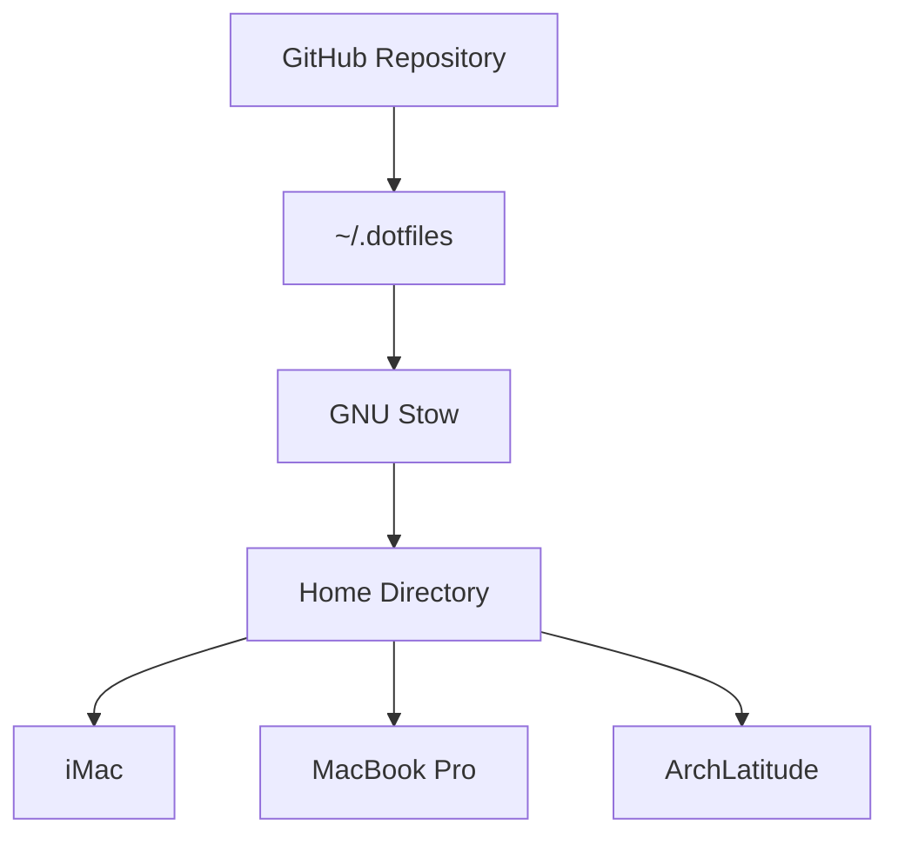

# Dotfiles

Personal development environment for macOS and Arch Linux.

This repository contains the configuration, documentation, conventions, and workflows used to maintain a consistent development environment across multiple machines.

---

## Goals

- Maintain a consistent development environment across macOS and Arch Linux.
- Keep configuration modular, documented, and easy to understand.
- Make changes incrementally using Git feature branches.
- Optimize the environment for long-term maintainability.
- Document workflows, not just configuration.

---

## Philosophy

This repository is more than a collection of dotfiles.

It documents the environment, conventions, and engineering decisions that allow multiple computers to behave as one familiar development workspace.

---

## Supported Machines

| Machine      | Role                                          |
| ------------ | --------------------------------------------- |
| iMac         | Primary workstation and command center        |
| MacBook Pro  | Portable development workstation              |
| ArchLatitude | Linux workstation, experimentation, downloads |

---

## Core Toolchain

- Ghostty
- Neovim
- Git
- GNU Stow
- Zsh
- Mullvad VPN
- MarkText

---

## Repository Layout

```text
docs/
ghostty/
git/
zsh/
dircolors/
private/
```

---

## Documentation

### Getting Started

- `README.md`
- `docs/new-machine.md`

### Environment

- `docs/architecture.md`
- `docs/developer-toolkit.md`
- `docs/house-conventions.md`

### Networking

- `docs/home-network.md`
- `docs/references/ssh-and-remote-development.md`

### Operations

- `docs/machine-status.md`
- `ROADMAP.md`

---

## Design Principles

- GitHub is the canonical source of truth.
- `~/.dotfiles` is the home of environment configuration.
- `~/Projects` is reserved for software and creative projects.
- Shared configuration is preferred whenever possible.
- Platform-specific behavior is isolated into small, focused files.
- Documentation explains **why**, not only **what**.

---

## Deployment

Configuration is deployed using GNU Stow.

Each top-level directory represents one independent Stow package.

```text
Packages
├── dircolors
├── ghostty
├── git
└── zsh
```

Deploy packages:

```bash
stow dircolors
stow ghostty
stow git
stow zsh
```

See `docs/architecture.md` for additional information.

---

## Current Status

- ✅ GNU Stow migration completed
- ✅ Multi-platform Zsh configuration
- ✅ Ghostty standardized
- ✅ Git configuration standardized
- ✅ SSH standardized across all machines
- ✅ Reserved DHCP addressing
- ✅ Mullvad VPN deployed
- ✅ MarkText deployed
- 🚧 Documentation refinement in progress

---

## Architecture


