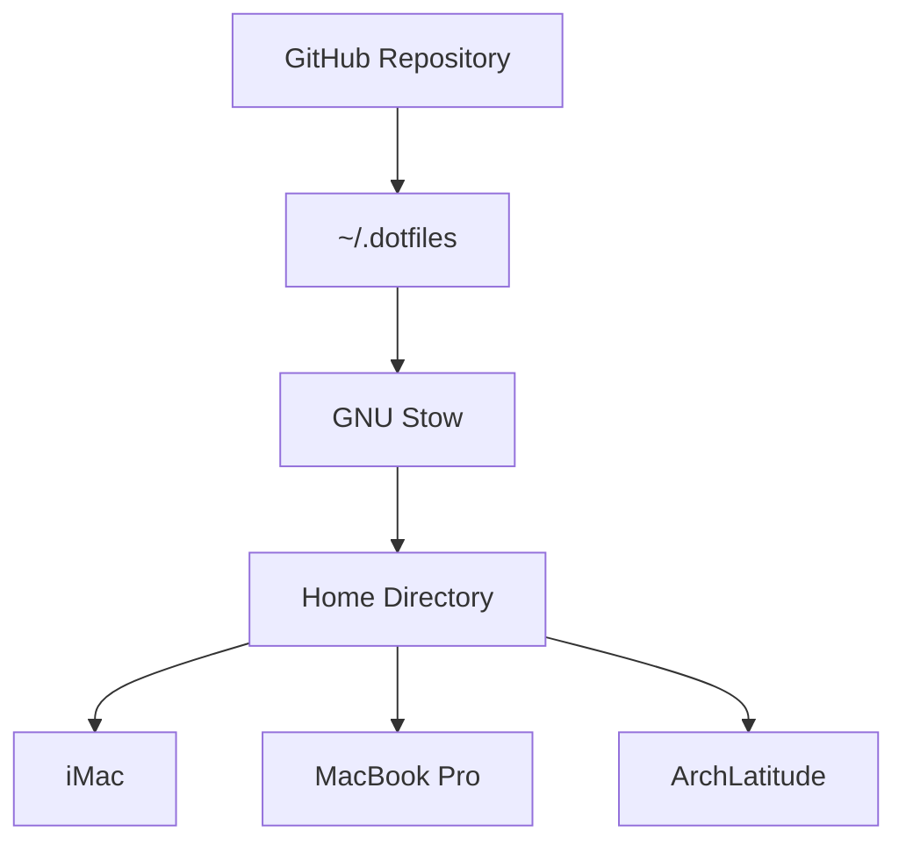
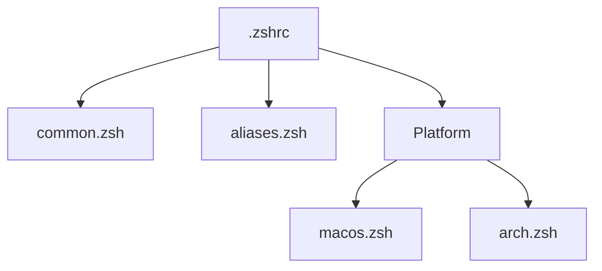

# Architecture

This document describes the architectural design of the dotfiles repository and the conventions used to maintain a consistent development environment across macOS and Arch Linux.

Rather than simply storing configuration files, the repository defines the structure, deployment strategy, and engineering principles that allow multiple computers to behave as one familiar development environment.

---

# Architecture Overview

The environment is organized as a layered architecture.



Each layer has a specific responsibility:

| Layer                | Responsibility                                            |
| -------------------- | --------------------------------------------------------- |
| GitHub               | Canonical source of truth and version history             |
| `~/.dotfiles`        | Local working copy of the repository                      |
| GNU Stow             | Deploys configuration using symbolic links                |
| Home Directory       | Standard configuration location expected by applications  |
| Development Machines | Consume a consistent configuration regardless of platform |

---

# Repository Organization

The repository separates documentation from deployable configuration.

```text
~/.dotfiles
├── docs/
├── dircolors/
├── ghostty/
├── git/
├── private/
└── zsh/
```

| Directory    | Purpose                                                            |
| ------------ | ------------------------------------------------------------------ |
| `docs/`      | Documentation describing the environment and engineering decisions |
| `dircolors/` | Shared directory color definitions                                 |
| `ghostty/`   | Ghostty terminal configuration                                     |
| `git/`       | Git configuration                                                  |
| `private/`   | Local documentation excluded from Git                              |
| `zsh/`       | Modular shell configuration                                        |

Software development projects are intentionally kept outside the repository in:

```text
~/Projects
```

This keeps environment configuration separate from application development.

---

# GNU Stow Architecture

Configuration is deployed using GNU Stow.

Each top-level application directory represents one independent Stow package.

For example:

```text
zsh/
└── .zshrc
```

is deployed as

```text
~/.zshrc
```

Likewise,

```text
ghostty/
└── .config/
    └── ghostty/
        └── config.ghostty
```

becomes

```text
~/.config/ghostty/config.ghostty
```

GNU Stow mirrors the directory structure beneath each package by creating symbolic links in the user's home directory.

---

# Zsh Architecture

The shell configuration is intentionally modular.



Shared behavior is defined once.

Platform-specific behavior is isolated into small, focused files, allowing each operating system to customize only the pieces that differ.

---

# Design Principles

The repository follows a small set of architectural principles.

- GitHub is the canonical source of truth.
- Configuration should exist in one place.
- GNU Stow deploys configuration using symbolic links rather than copying files.
- Shared configuration is preferred over duplicated configuration.
- Platform-specific behavior should remain small and isolated.
- Documentation should explain both **why** and **how** decisions were made.

---

# Managed Packages

The repository currently manages the following Stow packages.

- `dircolors`
- `ghostty`
- `git`
- `zsh`

Each package is self-contained and can be deployed independently.

---

## Related Documentation

### Repository

These documents describe the overall organization and conventions of the repository.

- [README](../README.md)
- [House Conventions](house-conventions.md)
- [Documentation Standards](documentation-standards.md)

### Environment

These documents describe the development environment and workstation configuration.

- [Developer Toolkit](developer-toolkit.md)
- [Machine Status](machine-status.md)
- [New Machine](new-machine.md)

### Networking

These documents describe the home network, private overlay networking, VPN egress, and remote administration.

- [Home Network](home-network.md)
- [SSH & Remote Development](references/ssh-and-remote-development.md)
- [Tailscale & Mullvad](references/tailscale-and-mullvad.md)
