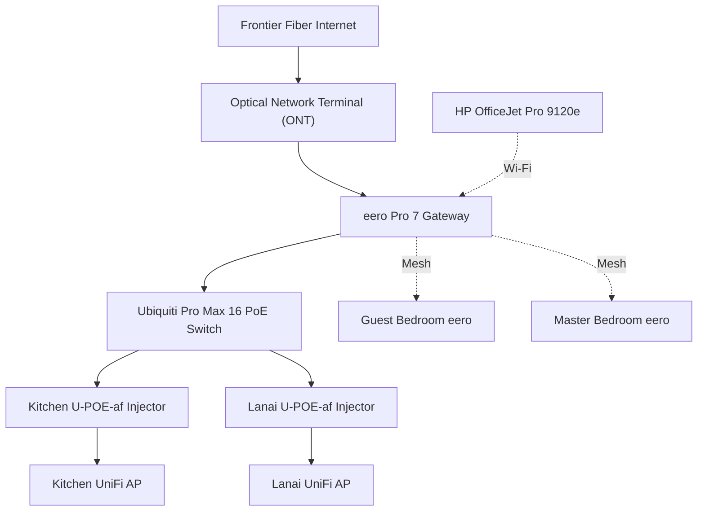

# Home Network Documentation

**Version:** 1.0  
**Last Updated:** 2026-07-29  
**Status:** Living Document

---

- **Residence:** Ralph Alberti
- **Community:** Del Webb
- **Location:** Lakewood Ranch, Florida
- **ISP:** Frontier Fiber (2 Gig Service)
- **Last Verified:** July 2026

# Purpose

This document describes the physical and logical architecture of the home network, including Internet connectivity, network equipment, wired and wireless infrastructure, IP addressing, and operational procedures.

Its purpose is to provide sufficient information to understand, maintain, troubleshoot, expand, or recover the network without requiring its design or configuration to be rediscovered.

This document records not only how the network is configured, but also why key design decisions were made. Preserving the reasoning behind the architecture is just as important as documenting the hardware itself.

# About This Document

This document captures my current understanding of the home network. It is intended to evolve as I learn more about its design, operation, and capabilities.

It will also evolve as the network itself grows through ongoing improvements, upgrades, and expansion. Future enhancements may include the addition of servers, network-attached storage (NAS), or other infrastructure components.

Some design decisions documented here were made before I assumed responsibility for the network. Where those decisions are not fully understood, they are documented based on my current understanding and will be refined as I learn more.

## Contents

- [Design Decisions](#design-decisions)
- [Internet Service](#internet-service)
- [Equipment Inventory](#equipment-inventory)
- [Physical Topology](#physical-topology)
- [Optical Network Terminal (ONT)](#optical-network-terminal-ont)
- [Internet Gateway](#internet-gateway)
- [Core Switch](#core-switch)
- [Wireless Infrastructure](#wireless-infrastructure)
- [Structured Cabling](#structured-cabling)
- [Network Services](#network-services)
- [Maintenance](#maintenance)
- [Troubleshooting](#troubleshooting)

# Design Decisions

This section captures the current understanding of the architectural decisions that shape the home network. Some decisions were made intentionally during later upgrades, while others were inherited as part of the original installation.

As my understanding grows, this section will document not only what the network looks like, but also why it was designed that way.

## Internet Service

**Provider:** Frontier Communications

**Service:** Fiber 2 Gig Internet

**Monthly Internet Charge:** $99.99 (before Auto Pay discount)

**Purpose:**

Provides high-speed Internet connectivity for the residence and serves as the foundation for all wired and wireless network services.

**Current Understanding:**

I selected Frontier Fiber over cable Internet primarily for two reasons:

- Higher Internet speeds
- Reliable support for YouTube TV

After becoming a Frontier customer, I learned they also offered eero mesh Wi-Fi equipment. Having both Internet service and Wi-Fi managed through a single provider simplified installation and ongoing support, so I decided to use their eero solution.

I later upgraded my service from 1 Gig to 2 Gig to provide additional bandwidth and headroom for future network growth.

Periodic router speed tests consistently confirm that the service is delivering the expected performance, with download and upload speeds exceeding 2 Gbps.

I also subscribe to NFL Sunday Ticket so I can watch New York Giants games throughout the football season.

**Optional Services:**

The current Frontier account includes the following optional monthly services:

| Service                | Monthly Cost | Current Understanding                                                                                                            |
| ---------------------- | ------------:| -------------------------------------------------------------------------------------------------------------------------------- |
| Frontier Provided eero | $7.00        | Rental of three eero Pro 7 mesh devices.                                                                                         |
| Whole-Home Wi-Fi       | $10.00       | Appears to duplicate functionality already available through the native eero application. Additional value is currently unclear. |
| Wi-Fi Security Plus    | $10.00       | Security-related service. The specific features and benefits are not yet fully understood.                                       |

**Current Observations:**

The MyFrontier application exposes much of the same information available within the eero application, including:

- eero device management
- Connected device inventory
- Router speed testing
- Wi-Fi insights

At this time it is not clear whether these capabilities are provided by the optional Whole-Home Wi-Fi service or simply integrated into the MyFrontier application.

**Questions for Frontier:**

- If Whole-Home Wi-Fi is cancelled, what functionality will be lost?
- Is the rental of Frontier-provided eero devices independent of the Whole-Home Wi-Fi service?
- What additional features are included with Wi-Fi Security Plus?
- Can either optional service be cancelled without affecting Internet performance or the operation of the eero mesh network?

**Historical Notes:**

A previous billing statement included a one-time $300 charge because the original eero Pro 6 equipment was not returned before Frontier's deadline. The equipment has since been returned and a credit is expected on a future bill.

# Equipment Inventory

This inventory identifies the major components that make up the home network. It serves as an index to the remainder of this document, where each component is described in greater detail.

| Role                  | Device                   | Manufacturer | Model               | Location                     | Status | Notes                                              |
| --------------------- | ------------------------ | ------------ | ------------------- | ---------------------------- | ------ | -------------------------------------------------- |
| Internet Service      | Fiber Internet           | Frontier     | Fiber 2 Gig         | External                     | Active | 2 Gig symmetrical fiber service                    |
| ONT                   | Optical Network Terminal | Nokia        | TBD                 | Laundry Room Network Cabinet | Active | Terminates the incoming fiber connection           |
| ONT Power Module      | ONT Power Module         | Nokia        | 3MV00743ABAB Rev 02 | Laundry Room Network Cabinet | Active | Provides power and reset functionality for the ONT |
| Internet Gateway      | Gateway                  | eero         | Pro 7               | Laundry Room Network Cabinet | Active | Primary router for the home network                |
| Core Switch           | Managed Switch           | Ubiquiti     | Pro Max 8 PoE       | Laundry Room Network Cabinet | Active | Central wired network switch                       |
| PoE Injector          | Kitchen AP Injector      | Ubiquiti     | U-POE-af            | Laundry Room Network Cabinet | Active | Supplies power to the Kitchen UniFi AP             |
| PoE Injector          | Lanai AP Injector        | Ubiquiti     | U-POE-af            | Laundry Room Network Cabinet | Active | Supplies power to the Lanai UniFi AP               |
| Wireless Access Point | Kitchen AP               | Ubiquiti     | UniFi AP            | Kitchen                      | Active | Ceiling-mounted access point                       |
| Wireless Access Point | Lanai AP                 | Ubiquiti     | UniFi AP            | Lanai                        | Active | Provides outdoor wireless coverage                 |
| Mesh Wi-Fi Node       | Guest Bedroom eero       | eero         | Pro 7               | Guest Bedroom (Office)       | Active | Mesh node extending Wi-Fi coverage                 |
| Mesh Wi-Fi Node       | Master Bedroom eero      | eero         | Pro 7               | Master Bedroom               | Active | Mesh node extending Wi-Fi coverage                 |
| Network Printer       | Printer                  | HP           | OfficeJet Pro 9120e | Guest Bedroom (Office)       | Active | Wireless color inkjet printer                      |

# Internet Gateway

The Internet Gateway is the central routing device for the home network. It connects the Frontier Fiber Internet service to all wired and wireless devices throughout the home. Every Internet connection, whether wired or wireless, passes through the Gateway.

## Purpose

The Gateway performs the following primary functions:

- Routes traffic between the home network and the Internet.
- Provides firewall protection between the Internet and internal devices.
- Manages the home's eero mesh Wi-Fi network.
- Connects the Frontier ONT to the internal network.
- Provides the uplink to the Ubiquiti Pro Max 16 PoE core switch.

## Current Understanding

The Gateway is a leased **eero Pro 7** provided by Frontier as part of the Internet service.

Although Frontier offers optional managed services such as **Whole-Home Wi-Fi** and **Wi-Fi Security Plus**, Frontier confirmed on July 28, 2026 that these services are **not required** for the Gateway or the three-node eero mesh network to operate normally. The only recurring charge required to retain the Gateway is the Frontier-provided eero equipment rental.

The Gateway also serves as the controller for the home's two additional eero Pro 7 mesh nodes located in the Guest Bedroom (Office) and the Master Bedroom.

## Physical Location

The Gateway is installed in the **Laundry Room Network Cabinet**.

Its location provides a centralized connection point between the Frontier ONT and the structured wiring that serves the rest of the home.

## Connectivity

The Gateway is connected as follows:

| Connection | Connected Device                        |
| ---------- | --------------------------------------- |
| WAN        | Frontier Optical Network Terminal (ONT) |
| LAN        | Ubiquiti Pro Max 16 PoE Switch          |
| Mesh       | Guest Bedroom eero Pro 7                |
| Mesh       | Master Bedroom eero Pro 7               |

## Operational Notes

- The Gateway is managed using the eero mobile application.
- Firmware updates are installed automatically by eero.
- Internet performance can be verified using the router speed test available through both the eero and MyFrontier applications.
- The Gateway should remain powered continuously during normal operation.

## Maintenance Notes

Routine maintenance is minimal.

Periodic verification should include:

- Confirm Internet speed meets the subscribed service level.
- Verify all three eero nodes remain online.
- Review connected devices for unexpected clients.
- Confirm firmware updates continue to install successfully.

## Outstanding Questions

The following items remain under investigation:

- Determine whether additional Gateway configuration information should be documented.
- Decide whether DHCP configuration belongs in this section or in a separate Network Services section.
- Determine whether firewall configuration should be documented here or separately.

# Physical Topology

The home network is centered around the **Laundry Room Network Cabinet**, which serves as the primary distribution point for Internet service, routing, switching, and structured cabling throughout the home.

Internet service enters the home through the Frontier Optical Network Terminal (ONT). The ONT connects to the eero Pro 7 Gateway, which provides Internet routing and manages the home's eero mesh network. The Gateway connects to the Ubiquiti Pro Max 16 PoE switch, which distributes wired network connectivity throughout the home.

Two UniFi wireless access points provide additional wireless coverage and are powered by dedicated Ubiquiti U-POE-af injectors. Wireless client devices, such as the HP OfficeJet Pro 9120e printer, connect to the home network through the eero mesh Wi-Fi system.



# Core Switch

The Core Switch is the central wired distribution point for the home network. It receives network connectivity from the eero Pro 7 Gateway and distributes Ethernet connectivity throughout the home using the structured cabling installed by the builder.

## Purpose

The Core Switch performs the following primary functions:

- Distributes wired network connectivity throughout the home.
- Connects infrastructure devices to the local network.
- Provides Power over Ethernet (PoE) capability.
- Serves as the central aggregation point for all wired Ethernet connections.

## Current Understanding

The Core Switch is a **Ubiquiti Pro Max 16 PoE** managed Ethernet switch located in the Laundry Room Network Cabinet.

The switch receives its uplink from the eero Pro 7 Gateway and provides network connectivity to structured cabling that serves multiple rooms throughout the home.

Although the switch is capable of supplying Power over Ethernet (PoE), the two UniFi Access Points are currently powered through dedicated Ubiquiti U-POE-af injectors installed between the switch and the access points. This configuration was installed by the original network installer and is operating reliably.

## Physical Location

The Core Switch is installed in the **Laundry Room Network Cabinet** directly below the eero Pro 7 Gateway.

Its centralized location provides convenient access to the home's structured Ethernet wiring.

## Connectivity

Current known connections include:

- Uplink from the eero Pro 7 Gateway.
- Kitchen UniFi Access Point (via U-POE-af injector).
- Lanai UniFi Access Point (via U-POE-af injector).
- Structured Ethernet runs to multiple rooms throughout the home.

Additional switch port assignments will be documented as they are identified.

## Operational Notes

- The switch is managed through the UniFi Network application.
- Power and link/activity LEDs provide a quick indication of switch and port status.
- The switch operates continuously and normally requires no routine maintenance.

## Maintenance Notes

Periodic verification should include:

- Confirm all expected Ethernet links are active.
- Verify PoE-powered devices remain operational.
- Check for firmware updates through the UniFi Network application.
- Document newly identified switch port assignments.

## Outstanding Questions

The following items remain under investigation:

- Complete a port-by-port mapping of all switch connections.
- Document unused switch ports.
- Record any VLAN configuration if implemented in the future.
- Determine whether any additional managed switch features are currently in use.

# Wireless Infrastructure

The home network uses multiple wireless technologies to provide reliable Wi-Fi coverage throughout the home. Wireless connectivity is provided through a combination of the eero mesh network and two ceiling-mounted UniFi Access Points.

## Purpose

The wireless infrastructure is designed to:

- Provide seamless Wi-Fi coverage throughout the home.
- Support mobile devices as they move throughout the residence.
- Extend network connectivity to devices where wired Ethernet is not practical.
- Provide reliable connectivity for smart home and network-connected devices.

## Current Understanding

The primary wireless network is managed by an eero Pro 7 mesh system consisting of three devices:

- eero Pro 7 Gateway (Laundry Room Network Cabinet)
- eero Pro 7 (Guest Bedroom / Office)
- eero Pro 7 (Master Bedroom)

The home also includes two ceiling-mounted UniFi Access Points located in the Kitchen and Lanai. These access points are connected to the wired network through dedicated Ubiquiti U-POE-af injectors.

Both wireless systems are functioning reliably and provide excellent coverage throughout the home.

## eero Mesh Network

The eero mesh network serves as the home's primary wireless networking platform.

Responsibilities include:

- Mesh Wi-Fi management
- Wireless client connectivity
- Automatic channel optimization
- Automatic firmware updates
- Integration with the Frontier Fiber Internet service

The eero system is managed through the eero mobile application.

## UniFi Access Points

Two UniFi Access Points are installed:

- Kitchen
- Lanai

The access points are connected to the Ubiquiti Pro Max 16 PoE Switch through dedicated Ubiquiti U-POE-af PoE injectors.

The original installer selected this configuration and it is operating reliably.

## Operational Notes

- Wireless coverage is excellent throughout the residence.
- Firmware updates are managed independently by the eero and UniFi platforms.
- The wireless infrastructure has required little maintenance since installation.

## Maintenance Notes

Periodic verification should include:

- Confirm all wireless access points remain online.
- Verify firmware updates complete successfully.
- Review wireless client connectivity if coverage issues arise.
- Document any future wireless expansion.

## Outstanding Questions

The following items remain under investigation:

- Better understand the relationship between the eero mesh network and the UniFi Access Points.
- Document wireless network architecture in greater detail.
- Determine whether additional UniFi management documentation should be included.

# Optical Network Terminal (ONT)

The Optical Network Terminal (ONT) serves as the physical termination point for Frontier's fiber-optic service inside the home. It converts the incoming optical fiber signal into Ethernet for use by the home's network equipment.

## Purpose

The ONT is responsible for:

- Receiving the incoming fiber-optic connection from Frontier.
- Converting the optical signal to Ethernet.
- Providing the Ethernet handoff to the home's Internet Gateway.
- Serving as the boundary between Frontier's network and the homeowner's network.

## Current Understanding

The ONT is installed inside the Laundry Room Network Cabinet.

The fiber-optic cable enters the cabinet and terminates at the ONT. An Ethernet cable connects the ONT directly to the eero Pro 7 Gateway, which performs routing, firewall, and local network services.

The ONT is owned and managed by Frontier.

## Connectivity

```
Frontier Fiber
        │
        ▼
Optical Network Terminal (ONT)
        │ Ethernet
        ▼
eero Pro 7 Gateway
```

## Operational Notes

- The ONT normally operates unattended and requires no user configuration.
- Internet connectivity depends on electrical power being available to the ONT and other network equipment.
- Status LEDs can assist in diagnosing power, fiber, or Ethernet connectivity issues.

## Maintenance Notes

The ONT is Frontier-owned equipment.

Routine maintenance is generally limited to:

- Verifying power is present.
- Confirming fiber and Ethernet cables remain securely connected.
- Reporting suspected hardware failures to Frontier.

The ONT should not be factory reset or otherwise modified.

## Outstanding Questions

The following items may be documented in a future revision:

- Manufacturer and model number.
- Indicator LED meanings.
- Power supply specifications.
- Determine whether the ONT includes battery backup or other power-fail capability.
- Photographs of the ONT and cable connections.

# Structured Cabling

The home uses a structured cabling system to provide wired Ethernet connectivity throughout the residence. All permanent network cabling is terminated in the Laundry Room Network Cabinet, where it connects to the core network infrastructure.

## Purpose

The structured cabling system is designed to:

- Provide reliable wired Ethernet connectivity throughout the home.
- Centralize all network terminations in a single location.
- Support network expansion without requiring new cable runs.
- Minimize visible wiring throughout the residence.

## Current Understanding

The home's Ethernet cabling was professionally installed by Uxari during the original smart home installation.

Individual cable runs terminate in the Laundry Room Network Cabinet and are connected to the Ubiquiti Pro Max 16 PoE Switch as needed.

Known connected devices include:

- Internet Gateway
- Kitchen UniFi Access Point
- Lanai UniFi Access Point
- Wall Ethernet outlets throughout the home

Additional cable runs may be available for future expansion.

## Distribution Architecture

The structured cabling follows a star topology.

```
                 +----------------+
                 | Core Switch    |
                 +----------------+
                   │ │ │ │ │ │ │
         ──────────┘ │ │ │ └──────────
            │         │ │
            ▼         ▼ ▼
      Kitchen AP   Lanai AP

            ▼
      Wall Ethernet Jacks

            ▼
     Future Network Devices
```

Each cable run is independent and terminates at the network cabinet. This simplifies troubleshooting and allows individual connections to be patched or reconfigured without affecting other network devices.

## Operational Notes

- All permanent Ethernet cabling terminates in the Laundry Room Network Cabinet.
- The core switch serves as the central distribution point for wired network connectivity.
- Unused cable runs may be connected as additional network devices are installed.

## Maintenance Notes

Periodic maintenance should include:

- Verify patch cables remain securely connected.
- Label newly connected cable runs.
- Update documentation when new devices are connected.
- Inspect cabinet cable management during major changes.

## Related Documentation

A detailed cable and switch port inventory is maintained separately in:

- `docs/cable-map.md`

This companion document contains room locations, wall jack identifiers, switch port assignments, and notes about each cable run.

## Outstanding Questions

The following items may be documented in a future revision:

- Create a complete port-to-room mapping.
- Label each wall jack and corresponding switch port.
- Document cable categories (Cat5e, Cat6, etc.).
- Identify any unused cable runs available for expansion.
- Add photographs of the network cabinet and cable terminations.

# Network Services

The home network provides a collection of core services that enable Internet access, local network communication, and wireless connectivity for devices throughout the residence.

## Purpose

The network services are designed to:

- Provide reliable Internet connectivity.
- Automatically configure network devices.
- Support secure wireless communication.
- Enable communication between devices on the local network.
- Simplify network administration through centralized management.

## Current Understanding

The eero Pro 7 Gateway provides the primary network services for the home network.

Known services include:

- Internet routing
- Network Address Translation (NAT)
- DHCP (automatic IP address assignment)
- Firewall protection
- Wireless network management

Additional services may be provided by Frontier or other network devices and will be documented as they are identified.

## Service Responsibilities

| Service          | Primary Device   |
| ---------------- | ---------------- |
| Internet Gateway | eero Pro 7       |
| Routing          | eero Pro 7       |
| DHCP             | eero Pro 7       |
| Firewall         | eero Pro 7       |
| Wi-Fi Management | eero Mesh System |

## Operational Notes

- Network services require the eero Gateway to be operational.
- Client devices receive their network configuration automatically.
- Most service configuration is managed through the eero mobile application.
- The network has operated reliably with minimal administrative intervention.

## Maintenance Notes

Periodic maintenance should include:

- Verify Internet connectivity.
- Confirm eero firmware is current.
- Review connected devices periodically.
- Document any newly enabled network services.

## Outstanding Questions

The following items may be documented in a future revision:

- DNS configuration details.
- IPv6 configuration.
- Guest network configuration.
- Port forwarding configuration (if required).
- VPN configuration after implementation.

# Maintenance

Routine maintenance helps ensure the home network continues to operate reliably and provides an opportunity to keep the documentation current.

## Routine Tasks

### Monthly

- Verify Internet connectivity.
- Check that all network equipment is operating normally.
- Review connected devices in the eero application.
- Confirm firmware updates have completed successfully.

### As Needed

- Update documentation after significant network changes.
- Label newly installed cables or equipment.
- Remove unused network devices.
- Review equipment placement if wireless coverage changes.

## Documentation Maintenance

The following documents should be updated whenever the network changes:

- `docs/home-network.md`
- `docs/cable-map.md`
- `private/network-secrets.md` (when sensitive information changes)

## Future Maintenance

Potential future maintenance activities include:

- Verify VPN operation.
- Review network performance.
- Audit unused switch ports and cable runs.
- Test power outage recovery procedures.

# Troubleshooting

This section provides a starting point for diagnosing common network issues.

## No Internet Connectivity

Check the following:

1. Verify commercial power is available.
2. Confirm the ONT has power and normal status indicators.
3. Verify the eero Gateway is online.
4. Check that the Gateway Ethernet connection to the ONT is secure.
5. Restart network equipment if appropriate.
6. Contact Frontier if the fiber service appears to be unavailable.

## Wireless Connectivity Issues

- Verify the device is connected to the expected wireless network.
- Check the eero application for network status.
- Restart the affected client device.
- Verify nearby access points are operational.

## Wired Connectivity Issues

- Verify the Ethernet cable is securely connected.
- Check switch link/activity indicators.
- Confirm the cable is connected to the expected switch port.
- Refer to `docs/cable-map.md` for current cable assignments.

## Lessons Learned

When a problem is diagnosed or a permanent solution is implemented, update the appropriate documentation so future troubleshooting is easier.
