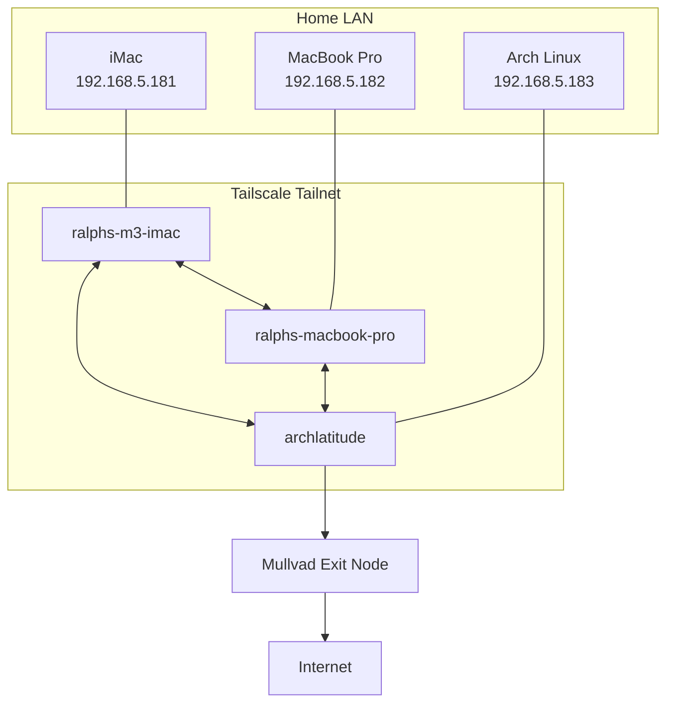

# Tailscale & Mullvad Reference

**Version:** 1.1
**Last Updated:** 2026-09-23
**Status:** Living Document

---

# About This Document

This document describes the Tailscale network used by the iMac, MacBook Pro, and Arch Linux systems, including machine-to-machine connectivity, SSH access, Mullvad exit nodes, local network access, and the qBittorrent VPN configuration on Arch Linux.

Its purpose is to preserve the architecture and reasoning behind the configuration so that the network can be maintained, tested, and recovered without rediscovering how the pieces fit together.

The physical home network, addressing, Internet service, and network equipment are documented separately in `docs/home-network.md`. Detailed SSH configuration and remote-development procedures are documented in `docs/references/ssh-and-remote-development.md`.

## Contents

- [Architecture](#architecture)
- [Tailnet](#tailnet)
- [SSH over Tailscale](#ssh-over-tailscale)
- [Exit Nodes](#exit-nodes)
- [Arch Linux](#arch-linux)
- [qBittorrent](#qbittorrent)
- [Operational Checks](#operational-checks)
- [Troubleshooting](#troubleshooting)
- [Related Documentation](#related-documentation)

---

# Architecture

## Purpose

Tailscale provides a private overlay network between the primary computers while preserving the existing home LAN.

The design provides two independent paths for machine-to-machine access:

- Direct LAN connectivity using reserved `192.168.5.x` addresses.
- Tailscale connectivity using stable tailnet names and Tailscale addresses.

Tailscale also provides optional Internet egress through Mullvad exit nodes.

## Design Decisions

- Keep normal LAN access available when machines are at home.
- Use Tailscale as an additional private path rather than replacing the LAN.
- Maintain separate SSH aliases for LAN and Tailscale access so the desired path is explicit.
- Use Mullvad exit nodes when VPN-protected Internet access is required.
- Allow local LAN access while a Mullvad exit node is active.
- Bind qBittorrent on Arch Linux to the Tailscale interface so torrent traffic depends on the Tailscale path.

## Logical Topology



The LAN and tailnet coexist. A machine can communicate directly with another machine through the home LAN or through Tailscale without changing the underlying SSH service.

## Traffic Paths

### Local LAN

```text
Arch -> 192.168.5.181 -> iMac
```

This path remains on the home network.

### Tailnet

```text
Arch -> Tailscale -> ralphs-m3-imac -> iMac
```

This path uses the Tailscale overlay network.

### Internet through Mullvad

```text
Arch -> tailscale0 -> Mullvad exit node -> Internet
```

---

# Tailnet

## Machines

| Machine | Operating System | Tailscale Name |
| --- | --- | --- |
| iMac | macOS | `ralphs-m3-imac` |
| MacBook Pro | macOS | `ralphs-macbook-pro` |
| Arch Linux | Arch Linux | `archlatitude` |

Tailscale addresses are assigned by Tailscale and normally do not need to be memorized. Human-readable Tailscale names are preferred in SSH configuration.

## Verify Tailnet Status

```bash
tailscale status
```

## Machine-to-Machine Verification

The mesh was verified by testing SSH between all three machines in both directions.

| Source | Destination | Alias |
| --- | --- | --- |
| iMac | MacBook Pro | `macbook-ts` |
| iMac | Arch Linux | `arch-ts` |
| MacBook Pro | iMac | `imac-ts` |
| MacBook Pro | Arch Linux | `arch-ts` |
| Arch Linux | iMac | `imac-ts` |
| Arch Linux | MacBook Pro | `macbook-ts` |

These aliases use ordinary OpenSSH over the Tailscale network.

---

# SSH over Tailscale

## LAN Access

The existing short SSH aliases use reserved LAN addresses:

```bash
ssh imac
ssh macbook
ssh arch
```

| Host | Address |
| --- | --- |
| iMac | `192.168.5.181` |
| MacBook Pro | `192.168.5.182` |
| Arch Linux | `192.168.5.183` |

## Tailscale Access

Tailscale aliases use a `-ts` suffix:

```bash
ssh imac-ts
ssh macbook-ts
ssh arch-ts
```

A typical entry is:

```sshconfig
Host arch-ts
  HostName archlatitude
  User ralph
  IdentityFile ~/.ssh/imac_ssh
  IdentitiesOnly yes
```

Each machine uses its own remote-login identity file.

## Why Keep Both Paths

LAN aliases are simple and direct at home. Tailscale aliases provide a stable private path that does not depend on the current LAN address or physical location.

They also provide a useful troubleshooting distinction:

```text
ssh arch       -> test LAN connectivity
ssh arch-ts    -> test Tailscale connectivity
```

---

# Exit Nodes

## Purpose

Normal Tailscale operation provides private connectivity between tailnet devices without routing ordinary Internet traffic through Tailscale.

An exit node provides an egress path for Internet traffic. Mullvad VPN servers are available as Tailscale exit nodes, allowing a machine to remain connected to the tailnet while sending Internet-bound traffic through Mullvad.

## Mullvad Exit Nodes

A Mullvad exit node can be selected independently on each machine. Selecting an exit node on Arch does not automatically select it on the iMac or MacBook Pro.

Rather than depending on a specific Mullvad endpoint, ask Tailscale to suggest an appropriate exit node:

```bash
tailscale exit-node suggest
```

The suggested Mullvad endpoint may change over time and should not be treated as permanent configuration.

## Arch Operator Permission

On Arch Linux, changing Tailscale preferences normally requires root privileges. Because Tailscale is used interactively on this system, the normal user is configured as the Tailscale operator.

This is a one-time configuration:

```bash
sudo tailscale set --operator=$USER
```

The operator setting persists. After it has been configured, routine Tailscale preference changes can be made without `sudo`.

Commands that only inspect Tailscale state, such as `tailscale status` and `tailscale exit-node suggest`, do not require this operator configuration.

## Select a Mullvad Exit Node on Arch

First ask Tailscale for its current suggestion:

```bash
tailscale exit-node suggest
```

Then use the suggested hostname when selecting the exit node. For example:

```bash
tailscale set \
  --exit-node=<suggested-node> \
  --exit-node-allow-lan-access=true
```

The `--exit-node-allow-lan-access=true` setting preserves direct access to devices on the home LAN while Internet-bound traffic uses the Mullvad exit node.

Verify:

```bash
tailscale status
curl https://am.i.mullvad.net/connected
```

## Disable the Exit Node

```bash
tailscale set --exit-node=
```

Verify again with the Mullvad connectivity check.

## Allow Local Network Access

The important mental model is:

> **Allow Local Network Access lets local-LAN traffic bypass the exit node and stay local while Internet traffic continues through the exit node.**

For example:

```text
ssh imac
Arch -> 192.168.5.181 -> iMac
       stays on LAN
```

while:

```text
Internet traffic
Arch -> Tailscale -> Mullvad -> Internet
```

and:

```text
ssh imac-ts
Arch -> Tailscale -> iMac
       stays within the tailnet
```

Enabling local network access does **not** mean that an SSH connection to a LAN address travels through the Mullvad server and then returns to the home network.

---

# Arch Linux

## Tailscale Interface

Tailscale creates:

```text
tailscale0
```

Verify:

```bash
ip link show tailscale0
```

The physical Wi-Fi interface remains responsible for the underlying LAN connection. Tailscale operates as an overlay on top of that connectivity.

## Physical LAN Routing

Inspect normal LAN routing with:

```bash
ip route
```

## TUN Support

Tailscale requires access to the Linux TUN device for normal kernel networking.

```bash
ls -l /dev/net/tun
```

If Tailscale cannot create or use its network interface, verify TUN support before troubleshooting higher-level routing or application behavior.

## Exit-Node State

```bash
tailscale status
tailscale exit-node suggest
```

---

# qBittorrent

## Design

qBittorrent runs on Arch Linux and is configured to use the Tailscale network interface rather than the physical Wi-Fi interface.

```text
Tools -> Options -> Advanced
Network Interface: tailscale0
```

The intended path is:

```text
qBittorrent -> tailscale0 -> Mullvad exit node -> Internet
```

## Why Bind to `tailscale0`

Binding qBittorrent to `tailscale0` prevents it from simply selecting the physical network interface as its normal BitTorrent path.

This behavior was tested rather than assumed.

## Verified Mullvad Path

Testing was performed with a legal Ubuntu torrent and a torrent-address detection magnet.

With the Mullvad exit node active:

- The Ubuntu torrent downloaded normally.
- qBittorrent was bound to `tailscale0`.
- The torrent-address detector reported the same Mullvad public IP being used by Arch through the exit node.
- The normal ISP public address was not exposed to the torrent-address test.

The specific public Mullvad address is not permanent configuration because exit-node public addresses can change.

## Fail-Closed Test

The exit node was disabled while qBittorrent remained bound to `tailscale0`.

The test established:

- Normal web traffic returned to the ISP connection.
- A fresh torrent-address detection attempt did not report the ISP public address.
- The torrent test received no new torrent announcement after the Mullvad exit path was removed.

This is the desired behavior: qBittorrent did not fall back to the normal ISP path during the test.

## Current Understanding

```text
Exit node ON
qBittorrent -> tailscale0 -> Mullvad -> Internet
```

```text
Exit node OFF
qBittorrent -> tailscale0 -> no verified torrent Internet path
```

The interface binding therefore provides practical fail-closed behavior for the tested configuration. Reverify this behavior after significant Tailscale, qBittorrent, or network configuration changes.

---

# Operational Checks

## Confirm the Current Machine

Before changing Tailscale or routing configuration:

```bash
hostname
```

This is especially important before using `sudo tailscale set` from an SSH session.

## Check Tailnet State

```bash
tailscale status
```

## Check Mullvad State

```bash
curl https://am.i.mullvad.net/connected
```

Do not depend on a particular Mullvad public IP address remaining constant.

## Check LAN Connectivity

Examples:

```bash
ping -c 3 192.168.5.181
ping -c 3 192.168.5.182
ping -c 3 192.168.5.183
```

Only test destinations other than the current machine.

## Check SSH Paths

Compare the appropriate pair:

```bash
ssh imac
ssh imac-ts
```

Successful connections through both aliases confirm that LAN and Tailscale access are independently available.

---

# Troubleshooting

## Exit Node Works but LAN Devices Are Unreachable

Verify that local network access is enabled.

First identify the currently selected exit node:

```bash
tailscale status
```

Then reapply the exit-node configuration with local LAN access enabled:

```bash
tailscale set \
  --exit-node=<selected-node> \
  --exit-node-allow-lan-access=true
```

Verify the LAN route and test the destination directly.

## Mullvad Is Not Active

```bash
tailscale status
curl https://am.i.mullvad.net/connected
```

If no exit node is active, select the desired Mullvad exit node again.

## qBittorrent Cannot Transfer

Confirm:

```text
Tools -> Options -> Advanced
Network Interface: tailscale0
```

Then confirm that the Mullvad exit node is active. If the exit node is intentionally disabled, inability to transfer may be the expected fail-closed behavior.

## LAN SSH Works but Tailscale SSH Does Not

```bash
tailscale status
ssh -G imac-ts | grep -E '^(hostname|user|identityfile|identitiesonly) '
```

Replace `imac-ts` with the destination being tested.

## Tailscale SSH Works but LAN SSH Does Not

```bash
ssh -G imac | grep -E '^(hostname|user|identityfile|identitiesonly) '
```

Compare the resolved hostname with the reserved address documented in `docs/home-network.md`.

## macOS Sleep and Remote Access

A sleeping Mac may not immediately respond through every network path.

If a Tailscale SSH connection initially fails while a LAN connection succeeds, allow the Mac time to wake and retry before treating the behavior as a Tailscale configuration failure.

## `known_hosts`

Host-key maintenance and effective SSH configuration checks are documented in:

```text
docs/references/ssh-and-remote-development.md
```

---

# Related Documentation

## Architecture

- `README.md`
- `docs/architecture.md`

## Networking

- `docs/home-network.md`
- `docs/cable-map.md`

## SSH and Remote Development

- `docs/references/ssh-and-remote-development.md`

## Documentation Standards

- `docs/documentation-standards.md`
